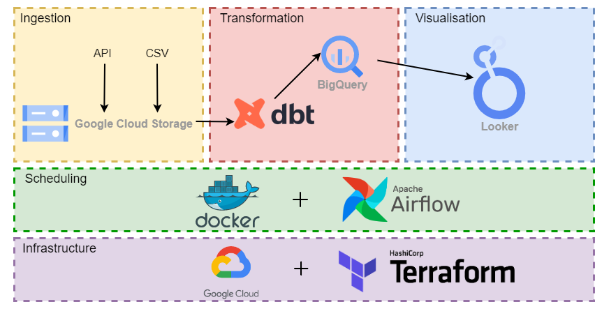

<h1>1. Introduction</h1>

The final project made for the <a href="https://github.com/DataTalksClub/data-engineering-zoomcamp">DataTalksClub/data-engineering-zoomcamp</a>. This project was made using big data cloud technologies and data from Rotten Tomatoes.
This document provides explanation to the installation process and is seperated into several sections.

<h3>Data Used</h3>

Data used is the rotten-tomatoes user and critics review.

<a href="https://components.one/datasets/film-reviews-208000-critic-reviews-and-10-7-million-user-reviews"> Link to website </a>

<h3>Important Links</h3>
<a href="https://lookerstudio.google.com/reporting/ff15f220-0c6c-4e90-a30e-79c9a998874d">Project visualization link</a>

<h3>Tools</h3>

To be able to run this project you need to have the have following software installed.

<ul>
<li>Docker</li>
<li>Terraform</li>
<li>Google Cloud Platform Account and Google Cloud SDK</li>
</ul>

<h1>2. Installation Steps</h1>

<ol>
<li>Clone this reposatory</li>
<li>Create the folder named keys/ under the rotten-tomatoes-datacamp-project/dags/
<li>Download the dataset from <a href="https://components.one/datasets/film-reviews-208000-critic-reviews-and-10-7-million-user-reviews"> here</a></li>
<li>Move the downloaded dataset into the rotten-tomatoes-datacamp-project/datasets </li>
<li>Create a Google Cloud Platform Account (GCP): <a href="https://cloud.google.com/"> here</a></li>
<ol>
<li>Create a service account by following the steps <a href="https://cloud.google.com/iam/docs/service-accounts-create"> here</a></li>
<li>Create and export a service account key by following the steps<a href="https://cloud.google.com/iam/docs/keys-create-delete"> here</a></li>
<li>Download the created service account key, rename it to gcp-cred.json and move it under rotten-tomatoes-datacamp-project/dags/keys/
</ol>
<li>Creating the infrastructure with Terraform</li>
<ol>
<li>In your Google Cloud Account copy your project ID which you can find after you login in to your GCP in the left corner near the Google Cloud icon or create a new project if you have none.</li>
<li>Open the file rotten-tomatoes-datacamp-project/terraform/main.tf
<li>Change the project ID to yours. So every <PUT YOUR GCP PROJECT ID HERE> occurence should be changed to your ID.</li>
<li> Change the name of the bucket rotten-tomatoes-bucket since GCP buckets have to have unique names.</li>
<li>Using the terminal move into rotten-tomatoes-datacamp-project/terraform folder</li>
<li>Run the command: terraform init </li>
<li>Run the command: terraform apply </li>
</ol>
  <li>Changing project ID inside the python script </li>
  <ol>
    <li>Open the rotten-tomatoes-datacamp-project/dags/data_ingestion.py</li>
    <li>Use ctrl-f to find "<PUT YOUR GCP PROJECT ID HERE>" and replace it with your project ID</li>
    <li>Change the value of the variable GCS_BUCKET into the name of your terraform bucket.</li>
  </ol>
  
<li>Docker</li>
<ol>
<li>Using terminal move into folder rotten-tomatoes-datacamp-project/ </li>
<li>Run the command: docker-compose up airflow-init</li>
<li>Run the command: docker compose up -d</li>
</ol>
<li>Pipeline progress can be tracked <a href="http://localhost:8080/">here</a></li>
<li>Final visualization can be seen <a href="https://lookerstudio.google.com/reporting/ff15f220-0c6c-4e90-a30e-79c9a998874d">here</a></li>
</ol>

<h1>3. Pipeline Infrastructure</h1>

<h3>Used Technologies</h3>

<ul>
  <li>Google Cloud Platform (GCP)</li>
  <li>Google Cloud Storage (GCS): Data Lake</li>
  <li>BigQuery: Data Warehouse</li>
  <li>Terraform: Infrastructure-as-Code (IaC)</li>
  <li>Docker: Containerization</li>
  <li>PostgreSQL: Data Analysis & Exploration</li>
  <li>Airflow: Workflow Orchestration</li>
  <li>dbt: Data Transformation</li>
  <li>Looker Studio: Visualization</li>
</ul>

<h3>Disclaimer</h3>
Everything is automated and replicable, but the Looker Studio. Data is processed and is already going to be inside BigQuery tables, so use the data however you want for the visualization by using the BigQuery as the source.

